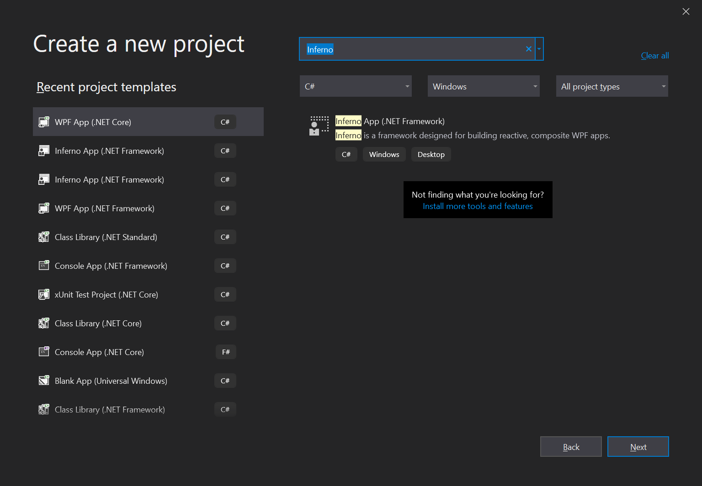

## Getting started

#### Introduction

How to create a new project with Inferno?

We'll review two options:

1. Using the Visual Studio project template
2. Installing the NuGet package(s) and building it from scratch 


#### Project template

The project template is without a doubt the fastest way to create a new Inferno project. For that alone, it's the preferred approach to start prototyping, start a new tutorial,... 

It gives you a .NET framework project (v4.6.1 minimum) with the *Inferno.Metro* package installed.

Following these steps:

- Visit the project on GitHub: https://github.com/ingenerics/Inferno
- Download the source code as a zip file (using the green button on the right).
- Unzip the file to get to the project template located in the `template` folder.
- [Locate your Visual Studio templates folder for User templates](https://docs.microsoft.com/en-us/visualstudio/ide/how-to-locate-and-organize-project-and-item-templates#user-templates)
- Move `Inferno App (.NET Framework).zip` to the `ProjectTemplates` folder.

Next, launch Visual Studio, create a new project and enter `Inferno` in the search box above.





#### From scratch

Obviously, this will require more work then simply using the template. So why build your project from scratch? 

- Both the template and MahApps.Metro have a dependency on the .NET Framework libraries. 
  Note the `ScoreBoard` sample project circumvents this by targeting .NET Framework from within a .NET Core project. Ref `ScoreBoard.csproj`:

  ```xaml
  <Project Sdk="Microsoft.NET.Sdk.WindowsDesktop">
  
    <PropertyGroup>
      <OutputType>WinExe</OutputType>
      <TargetFramework>net461</TargetFramework>
      <UseWPF>true</UseWPF>
    </PropertyGroup>
  
    // ... (left out for brevity)
  
  </Project>
  ```

  So if you do not want this dependency you'll have to create a .NET Core project from scratch and install the `Inferno.Wpf` package instead of `Inferno.Metro`. If you want to learn more on how the NuGet packages relate, please refer to the *Bootstrapper* section of the documentation.

- If you're looking to start a long term project, you'll probably want more control over the components the project is made up of. Easiest way to ensure that is by starting from scratch. In that case, it might be worth considering to forego installing the WPF packages all together and copying the contained code to the target project. This will greatly increase the possibility to customize this part of the framework as new requirements arise.


Let's get to it:

- Start a new WPF project, minimum specs:

  - .NET Framework 4.6.1
  - .NET Core 3.1

- Add NuGet packages:

  - Inferno.Wpf or Inferno.Wpf.Metro (or one of the other packages, depending on your requirements). Note installing one of both aforementioned packages, will automatically prompt NuGet to install the other Inferno packages they depend on.
  - SimpleInjector (if you choose another DI Container, you'll need to create a custom wrapper analogues to `SimpleInjectorDependencyResolver`, ref *Bootstrapper* documentation).

- Create a folder named `Bootstrap`

- Create `SimpleInjectorDependencyResolver.cs` in the folder and copy the contents from the sample below. Be sure to change `MyApp` from the namespace assignment.

  ```c#
  using Inferno.Core;
  using SimpleInjector;
  using System;
  using System.Collections.Generic;
  
  namespace MyApp.Bootstrap
  {
      public class SimpleInjectorDependencyResolver : IDependencyResolver
      {
          private readonly Container _container;
          private readonly IServiceProvider _provider;
  
          public SimpleInjectorDependencyResolver(Container container)
          {
              _container = container;
              _provider = container;
          }
  
          public object GetInstance(Type serviceType)
              => _container.GetInstance(serviceType);
  
          public TService GetInstance<TService>() where TService : class
              => _container.GetInstance<TService>();
  
          public IEnumerable<object> GetAllInstances(Type serviceType)
              => _container.GetAllInstances(serviceType);
  
          public IEnumerable<TService> GetAllInstances<TService>() where TService : class
              => _container.GetAllInstances<TService>();
  
          public bool TryGetInstance(Type serviceType, out object instance)
          {
              instance = _provider.GetService(serviceType);
              return instance != null;
          }
  
          public bool TryGetInstance<TService>(out TService instance)
              where TService : class
          {
              instance = (TService)_provider.GetService(typeof(TService));
              return instance != null;
          }
      }
  }
  ```

- Create `AppBootstrapper.cs` in the folder and copy the contents from the sample below. 

  *This is the `AppBootstrapper` for the `Inferno.Wpf` package. The `AppBootstrapper` for `Inferno.Metro` can be copied from the `ScoreBoard` sample.*

  Be sure to change `MyApp` from the namespace assignment.

  ```c#
  using Inferno;
  using Inferno.Core;
  using Inferno.Core.Logging;
  using Inferno.Wpf.Shared.IconManagement.Octicons;
  using SimpleInjector;
  using System.Reactive.Concurrency;
  using System.Windows;
  
  namespace MyApp.Bootstrap
  {
      public class AppBootstrapper : BootstrapperBase
      {
          public AppBootstrapper(Application application) : base(application)
          {
              Initialize();
          }
  
          protected override IDependencyResolver Configure()
          {
              // 1. Create a new Simple Injector container
              var container = new Container();
  
              // 2. A wrapper that adheres to Inferno's internal contract (SimpleInjector adapter).
              // -> There are no direct references to SimpleInjector classes outside of this method.
              var dependencyResolver = new SimpleInjectorDependencyResolver(container);
  
              // 3. Configure the container
              //    Register app components
              var logger = new DebugLogger();
              var themeManager = 
                  new ThemeManager(
                      MahAppsTheme.BaseDark, 
                      MahAppsAccent.Steel,
                      new OcticonsResourceManager());
  
              container.RegisterInstance(SelectAssemblies());
              container.RegisterInstance<ILogger>(logger);
              container.RegisterInstance<IThemeManager>(themeManager);
              container.Register<IViewLocator, ViewLocator>(Lifestyle.Singleton);
              container.Register<IViewModelBinder, ViewModelBinder>(Lifestyle.Singleton);
              container.Register<ICommandBinderImplementation, CommandBinderImplementation>(Lifestyle.Singleton);
              container.Collection.Register<ICreatesObservableForProperty>(new INPCObservableForProperty(), new IROObservableForProperty(), new POCOObservableForProperty(logger), new DependencyObjectObservableForProperty(logger));
              container.Collection.Register<ICreatesCommandBinding>(new CreatesCommandBindingViaEvent(), new CreatesCommandBindingViaCommandParameter());
              container.Collection.Register<IBindingTypeConverter>(new EqualityTypeConverter(logger), new StringConverter(), new ComponentModelTypeConverter(), new BooleanToVisibilityTypeConverter());
              container.Collection.Register<ISetMethodBindingConverter>(new NullSetMethodBindingConverter());
              container.Collection.Register<IPropertyBindingHook>(new NullObjectBindingHook());
              container.Collection.Register<ILoadedForViewFetcher>(new LoadedForViewFetcher());
              container.RegisterInstance<IDependencyResolver>(dependencyResolver); // Used by IViewLocator to resolve views
              //    Components that are not covered by unit tests
              container.RegisterInstance(_application);
              container.Register<IWindowManager, WindowManager>(Lifestyle.Singleton);
              container.Register<IDialogManager, DialogManager>(Lifestyle.Singleton);
              
              // 4. Verify your configuration (optional)
              container.Verify();
  
              return dependencyResolver;
          }
  
          protected override void OnStartup(object sender, StartupEventArgs e)
          {
              RxApp.Initialize(DependencyResolver, DispatcherScheduler.Current);
              RxLifeCycle.Initialize(DependencyResolver);
  
              DisplayRootViewFor<ShellViewModel>();
          }
  
          /// <summary>
          /// Override to tell the framework where to find assemblies to inspect for views.
          /// </summary>
          /// <returns>A list of assemblies to inspect.</returns>
          protected override AssemblySource SelectAssemblies()
          {
              return new AssemblySource(typeof(IDialogManager).Assembly, typeof(ShellView).Assembly);
          }
      }
  }
  ```

- Remove the code `StartupUri="MainWindow.xaml"` from `App.xaml`.

- Replace the `App` declaration in `App.xaml.cs` with the following code.

  ```c#
  public partial class App : Application
  {
      public App()
      {
          new AppBootstrapper(this);
      }
  }
  ```

- Add a root view model to the project, I named it `ShellViewModel`. In the spirit of Inferno and its component lifecycle, this is usually a conductor. Which kind of conductor and the type of view model(s) it is conducting depends entirely on your requirements. For the sake of example `Conductor<IScreen>` is used.

  ```c#
  public class ShellViewModel : Conductor<IScreen>
  {
      private readonly IDialogManager _dialogManager;
  
      public ShellViewModel(IDialogManager dialogManager)
      {
          _dialogManager = dialogManager;
      }
  
      protected override Task OnInitializeAsync(CancellationToken cancellationToken)
      {
          DisplayName = "My window title";
  
          return Task.CompletedTask;
      }
  }
  ```

  As a bare minimum you'll want your DI container to inject an `IDialogManager` to your root view model, so it can provide it to children that might need it. `OnInitializeAsync` can be used to initialize the `Screen` (`ConductorBase<T>` derives from `Screen`). I rarely use view model constructors for more than storing injected dependencies and defining reactive scopes. In the real world you'd also want to check the injected dependencies for invalid values (or null) and act accordingly.

- Given Inferno uses naming convention to map view models to views, and we've instructed Inferno to launch `ShellViewModel` in `AppBootstrapper`, we'll need to rename `MainWindow`. Right-click `MainWindow.xaml` in *solution explorer* and choose *Rename*. Rename `MainWindow` to `ShellView`. Unfold the `MainWindow.xaml` hierarchy in *solution explorer* and verify `MainWindow.xaml.cs` is renamed to `ShellView.xaml.cs` as well.

- Replace the contents of `ShellView.xaml` with the following XAML. 

  *Be sure to change both occurrences of `MyApp` to the namespace used in your project.*

  ```xaml
  <inferno:RxWindow
      x:Class="MyApp.ShellView"
      x:TypeArguments="local:ShellViewModel" 
      xmlns="http://schemas.microsoft.com/winfx/2006/xaml/presentation"
      xmlns:x="http://schemas.microsoft.com/winfx/2006/xaml"
      xmlns:mc="http://schemas.openxmlformats.org/markup-compatibility/2006"
      xmlns:d="http://schemas.microsoft.com/expression/blend/2008"
      xmlns:inferno="http://inferno.net"
      xmlns:local="clr-namespace:MyApp"
      mc:Ignorable="d" WindowStartupLocation="CenterScreen"
      d:DesignHeight="300" d:DesignWidth="300">
      <inferno:CompositionControl x:Name="Host" />
  </inferno:RxWindow>
  ```

- Replace the contents of `ShellView.xaml.cs` with the sample below. Be sure to change `MyApp` from the namespace assignment.

  ```c#
  using Inferno;
  
  namespace MyApp
  {
      /// <summary>
      /// Interaction logic for ShellView.xaml
      /// </summary>
      public partial class ShellView : RxWindow<ShellViewModel>
      {
          public ShellView()
          {
              InitializeComponent();
  
              this.WhenLoaded(d =>
              {
                  this.OneWayBind(ViewModel,
                          viewModel => viewModel.ActiveItem,
                          view => view.Host.ViewModel)
                      .DisposeWith(d);
              });
          }
      }
  }
  ```

- Add a folder for `ViewModels` and one for `Views`.


#### Next

[ScoreBoard](../ScoreBoard/ScoreBoard.md)


