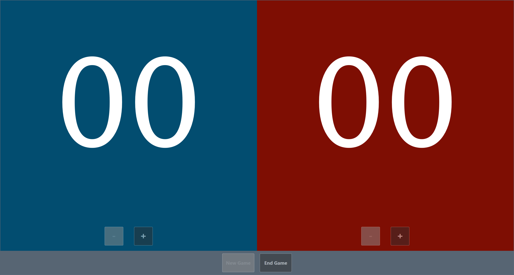

## ScoreBoard

#### Introduction

The goal of this tutorial is to get you up and running with Inferno quickly. It does try, however, to steer you in the direction of the functional paradigm. As I believe you get the best out of Inferno by first trying to walk the path of pure functions (no side-effects) and then being pragmatic once you've established how the data should flow. 


#### Score

We're going to build a score board. At the lowest level we have two child components, each representing the score for one team. 





Create a new project named `ScoreBoard` following the guidelines from the [Getting started](../GettingStarted/GettingStarted.md) tutorial.

Remove any contents from the `ViewModels` and `Views` folders. Note every self respecting app would want a domain layer as well. Due to the shear simplicity of our model, we're going to skip that.

Add `ScoreViewModel.cs` to the `ViewModels` folder and update the contents of `ShellViewModel` (found at the root level).

```c#
public class ShellViewModel : Conductor<ScoreViewModel>
{
    // ... (Left out for brevity)

    protected override Task OnInitializeAsync(CancellationToken cancellationToken)
    {
        // ... (Left out for brevity)

        ActiveItem = new ScoreViewModel();

        return Task.CompletedTask;
    }
}
```


For our `ScoreViewModel` we'll implement two commands, to increment and decrement the score. In the reactive realm commands are observable(s) themselves. Allowing for functional composition of the stream of "increments" and "decrements". We'll use the scan function to aggregate all values, and then store the total with a call to `ToProperty`.

```c#
using Inferno;
using System.Reactive;
using System.Reactive.Linq;

namespace ScoreBoard.ViewModels
{
    public class ScoreViewModel : ReactiveObject
    {
        private readonly RxPropertyHelper<int> _score;

        public ScoreViewModel()
        {
            IncrementScoreCommand = ReactiveCommand.Create(() => 1);
            DecrementScoreCommand = ReactiveCommand.Create(() => -1);

            _score = Observable.Merge(
                    IncrementScoreCommand,
                    DecrementScoreCommand)
                .Scan(0, (acc, delta) => acc + delta)
                .ToProperty(this, x => x.Score);
        }

        public int Score => _score.Value;

        public ReactiveCommand<Unit, int> IncrementScoreCommand { get; private set; }
        public ReactiveCommand<Unit, int> DecrementScoreCommand { get; private set; }
    }
}
```

Add a `UserControl` named `ScoreView` to the `Views` folder and update `ScoreView.xaml`.

```xaml
<inferno:RxUserControl 
    x:Class="ScoreBoard.Views.ScoreView"
    x:TypeArguments="viewModels:ScoreViewModel"
    xmlns="http://schemas.microsoft.com/winfx/2006/xaml/presentation"
    xmlns:d="http://schemas.microsoft.com/expression/blend/2008"
    xmlns:x="http://schemas.microsoft.com/winfx/2006/xaml"
    xmlns:mc="http://schemas.openxmlformats.org/markup-compatibility/2006"
    xmlns:inferno="http://inferno.net"
    xmlns:viewModels="clr-namespace:ScoreBoard.ViewModels"
    mc:Ignorable="d" 
    d:DesignHeight="450" d:DesignWidth="800">
    <DockPanel x:Name="Panel" LastChildFill="True">
        <StackPanel DockPanel.Dock="Bottom" 
                    Orientation="Horizontal" HorizontalAlignment="Center">
            <Button x:Name="DecrBtn" Height="70" Width="70" 
                    VerticalAlignment="Bottom" Opacity="0.5" Margin="20">
                <TextBlock Text="-" FontSize="36" Height="60" />
            </Button>
            <Button x:Name="IncrBtn" Height="70" Width="70"
                    VerticalAlignment="Bottom" Opacity="0.5" Margin="20">
                <TextBlock Text="+" FontSize="36" Height="60" />
            </Button>
        </StackPanel>
        <Viewbox>
            <Label x:Name="ScoreLabel"
                   ContentStringFormat="D2" FontFamily="Lucida Console" />
        </Viewbox>
    </DockPanel>
</inferno:RxUserControl>
```

And `ScoreView.xaml.cs` with the code behind.

```c#
using Inferno;
using ScoreBoard.ViewModels;

namespace ScoreBoard.Views
{
    public partial class ScoreView : RxUserControl<ScoreViewModel>
    {
        public ScoreView()
        {
            InitializeComponent();

            this.WhenLoaded(disposables =>
            {
                this.OneWayBind(ViewModel,
                        viewModel => viewModel.Score,
                        view => view.ScoreLabel.Content)
                    .DisposeWith(disposables);

                this.BindCommand(ViewModel,
                        viewModel => viewModel.DecrementScoreCommand,
                        view => view.DecrBtn)
                    .DisposeWith(disposables);

                this.BindCommand(ViewModel,
                        viewModel => viewModel.IncrementScoreCommand,
                        view => view.IncrBtn)
                    .DisposeWith(disposables);
            });
        }
    }
}
```

The `WhenLoaded` scope will ensure that once the view is rendered, the necessary bindings are instantiated. If you're looking for more of an in depth exploration of the API, remember ReactiveUI's [documentation](https://reactiveui.net/docs/handbook/) is your friend.

You're good to go! Run the app and hit the `+` button, now hit the `-` button a couple of times more. What's this then? A negative score? That can't be right...


#### Modelling

Just as with the BCL `ICommand` implementation, we can add a `CanExecute` argument. Although, instead of a `Func<TInput,bool>` it is modelled through an `IObservable<bool>`, promoting functional composition. In our `ScoreViewModel`, replace the `DecrementScoreCommand` declaration with the code below.

```c#
var canDecrement = 
    this
    .WhenAnyValue(x => x.Score)
    .Select(score => score > 0);

DecrementScoreCommand = ReactiveCommand.Create(() => -1, canDecrement);
```

If we try to run the code now, we get a null ref. The `canDecrement` code tries to access `Score`, but the call to `ToProperty`, which initializes it, comes later. Sounds like a chicken and egg problem, right? Fortunately, we can get around quick and dirty with a bit of null checking and coalescing.

```c#
public int Score => _score?.Value ?? 0;
```

Remember I talked about walking the path of pure functions? The line above doesn't look so pure anymore, now does it? This is where we should consider if our design would benefit from a more pragmatic approach. Let's have a look at an equivalent implementation, this time with the typical notifying prop to hold the score. *You'll need to add a `using System;` directive for the `Subscribe()` overload to be found.*

```c#
public class ScoreViewModel : ReactiveObject
{
    public ScoreViewModel()
    {
        IncrementScoreCommand = ReactiveCommand.Create(() => 1);

        var canDecrement =
            this
            .WhenAnyValue(x => x.Score)
            .Select(score => score > 0);
            
        DecrementScoreCommand = ReactiveCommand.Create(() => -1, canDecrement);

        Observable.Merge(
            IncrementScoreCommand,
            DecrementScoreCommand)
        .Scan(0, (acc, delta) => acc + delta)
        .Do(x => Score = x)
        .Subscribe();
    }

    private int _score;
    public int Score
    {
        get => _score;
        set => this.RaiseAndSetIfChanged(ref _score, value);
    }

    public ReactiveCommand<Unit, int> IncrementScoreCommand { get; private set; }
    public ReactiveCommand<Unit, int> DecrementScoreCommand { get; private set; }
}
```

I hope you can appreciate the beauty of declarative programming? Apart from the implementation of `_score` and `Score` and the last expression in the constructor, nothing's changed! Given `Score` is notifying in both cases, the processing logic can remain blissfully unaware of any changes.
We did introduce side-effects, as a matter of fact, we've tried to make them explicit by passing the `Action` to `Do(...)` instead of `Subscribe(...)`.

I'd still prefer to explore the pure pipeline (our first attempt, without side effects). Luckily, there's a `Switch` construct we can use to circumvent the chicken and egg problem. But first, allow me to introduce the component lifecycle.


#### LifeCycle

The lifecycle hooks ReactiveUI view models have access to out of the box are rather limited. There's an [IActivatableViewModel](https://reactiveui.net/docs/handbook/when-activated/#viewmodels) abstraction you can use to decorate a view model. Exposing a `WhenActivated` scope, similar to the one found in the view.

Further exploring our pure pipeline, the `WhenActivated` event of `ScoreViewModel` is not the one we are most interested in. We don't want to initialize the score each time the view (model) gets activated, just the first time, when the view model is initialized.

Inferno exposes three scopes out of the box (ref *Component Lifecycle* documentation):

- `WhenActivated`
- `WhenInitialized`
- `WhenLoaded` (maps to ReactiveUI's `WhenActivated`. Again, please refer to Inferno's documentation)

Let's update `ScoreViewModel` to:

- Derive from `Screen` instead of `ReactiveObject`.

- Create the subscriptions when the `Screen` is initialized, i.e. when it is activated for the first time.
- Implement a `WhenInitializedSwitch` so `Score` will only be queried once the `WhenInitialized` scope is completed. Providing an initial value of `false` until then.
- Add a `ResetScoreCommand`. Have a look at the `Func<int>` passed to its `ReactiveCommand.Create`.
- Add a property to hold the score's background color, so we can provide separate colors from the `ScoreBoardViewModel` we'll implement in the next section.

```c#
public class ScoreViewModel : Screen
{
    private RxPropertyHelper<int> _score;

    public ScoreViewModel(string backgroundColor)
    {
        BackgroundColor = backgroundColor;

        this.WhenInitialized(disposables =>
        {
            IncrementScoreCommand = ReactiveCommand.Create(() => 1).DisposeWith(disposables);

            CanDecrement =
                this.WhenInitializedSwitch(
                    this
                        .WhenAnyValue(x => x.Score)
                        .Select(score => score > 0),
                    false);

            DecrementScoreCommand = ReactiveCommand.Create(() => -1, CanDecrement).DisposeWith(disposables);

            ResetScoreCommand = ReactiveCommand.Create(() => -Score).DisposeWith(disposables);

            _score =
                Observable.Merge(
                    IncrementScoreCommand,
                    DecrementScoreCommand,
                    ResetScoreCommand)
                .Scan(0, (acc, delta) => acc + delta)
                .ToProperty(this, x => x.Score)
                .DisposeWith(disposables);
        });
    }

    public int Score => _score.Value;

    public IObservable<bool> CanDecrement { get; private set; }
    public ReactiveCommand<Unit, int> IncrementScoreCommand { get; private set; }
    public ReactiveCommand<Unit, int> DecrementScoreCommand { get; private set; }
    public ReactiveCommand<Unit, int> ResetScoreCommand { get; private set; }

    public string BackgroundColor { get; }
}
```
Add the following code to the `WhenLoaded` scope in `ScoreView.xaml.cs`.

`BrushConverter` can be found in *System.Windows.Media*.

```c#
this.OneWayBind(ViewModel,
        viewModel => viewModel.BackgroundColor,
        view => view.Panel.Background,
        hex => new BrushConverter().ConvertFrom(hex))
    .DisposeWith(disposables);
```
And update the constructor in `ShellViewModel` accordingly.

```
ActiveItem = new ScoreViewModel("#FF024D70");
```

For the time being, if you want to take the reset code for a spin, just replace `DecrementScoreCommand` with `ResetScoreCommand` in `ScoreView.xaml.cs`. *How does this affect the button's "canExecute"?*


#### ScoreBoard

Start by adding `ScoreBoardViewModel` and `ScoreBoardView` to their respective folders. The view model merely builds upon existing functionality:

- `ScoreBoardViewModel` is a `Conductor<ScoreViewModel>.Collection.AllActive`. It can have multiple children and all of them will be active at the same time. 
- `OnInitializeAsync` is executed on first activation, creating both `ScoreViewModel`s and adding them to the conductor's `Items` collection.
- After first activation, the `WhenInitialized` scope will be executed.
- The `CombinedReactiveCommand`'s `execute` and `canExecute` arguments are composed from properties of the individual `ScoreViewModel`s.

```c#
public class ScoreBoardViewModel : Conductor<ScoreViewModel>.Collection.AllActive
{
    public ScoreBoardViewModel()
    {
        this.WhenInitialized(disposables =>
        {
            var canStartNewGame =
                Observable.CombineLatest(
                    ScoreHomeTeam.CanDecrement,
                    ScoreVisitors.CanDecrement,
                    (canHomeDecr, canVisitorsDecr) => canHomeDecr || canVisitorsDecr);

            NewGameCommand =
                ReactiveCommand.CreateCombined(
                    new[]
                    {
                        ScoreHomeTeam.ResetScoreCommand,
                        ScoreVisitors.ResetScoreCommand
                    },
                    canStartNewGame)
                .DisposeWith(disposables);
        });
    }

    protected override Task OnInitializeAsync(CancellationToken cancellationToken)
    {
        ScoreHomeTeam = new ScoreViewModel("#FF024D70") { DisplayName = nameof(ScoreHomeTeam) };
        ScoreVisitors = new ScoreViewModel("#FF7E0E03") { DisplayName = nameof(ScoreVisitors) };

        Items.Add(ScoreHomeTeam);
        Items.Add(ScoreVisitors);

        return Task.CompletedTask;
    }

    private ScoreViewModel _scoreHomeTeam;
    public ScoreViewModel ScoreHomeTeam
    {
        get => _scoreHomeTeam;
        set => this.RaiseAndSetIfChanged(ref _scoreHomeTeam, value);
    }

    private ScoreViewModel _scoreVisitors;
    public ScoreViewModel ScoreVisitors
    {
        get => _scoreVisitors;
        set => this.RaiseAndSetIfChanged(ref _scoreVisitors, value);
    }

    public CombinedReactiveCommand<Unit, int> NewGameCommand { get; private set; }
}
```
`ScoreBoardView.xaml` composes both child views.

```xaml
<inferno:RxUserControl 
    x:Class="ScoreBoard.Views.ScoreBoardView"
    x:TypeArguments="viewModels:ScoreBoardViewModel"
    xmlns="http://schemas.microsoft.com/winfx/2006/xaml/presentation"
    xmlns:d="http://schemas.microsoft.com/expression/blend/2008"
    xmlns:x="http://schemas.microsoft.com/winfx/2006/xaml"
    xmlns:mc="http://schemas.openxmlformats.org/markup-compatibility/2006"
    xmlns:inferno="http://inferno.net"
    xmlns:viewModels="clr-namespace:ScoreBoard.ViewModels"
    xmlns:views="clr-namespace:ScoreBoard.Views"
    mc:Ignorable="d" 
    d:DesignHeight="450" d:DesignWidth="800">
    <DockPanel LastChildFill="True" Background="#FF798C8C">
        <Button x:Name="NewBtn" DockPanel.Dock="Bottom"
                Height="70" Width="120" Margin="10">
            <TextBlock Text="New Game" FontSize="18"></TextBlock>
        </Button>
        <Grid>
            <Grid.ColumnDefinitions>
                <ColumnDefinition />
                <ColumnDefinition />
            </Grid.ColumnDefinitions>
            <views:ScoreView x:Name="ScoreHomeTeam" Grid.Column="0" />
            <views:ScoreView x:Name="ScoreVisitors" Grid.Column="1" />
        </Grid>
    </DockPanel>
</inferno:RxUserControl>
```

And `ScoreBoardView.xaml.cs` glues it all together.

```c#
public partial class ScoreBoardView : RxUserControl<ScoreBoardViewModel>
{
    public ScoreBoardView()
    {
        InitializeComponent();

        this.WhenLoaded(disposables =>
        {
            this.OneWayBind(ViewModel,
                    viewModel => viewModel.ScoreHomeTeam,
                    view => view.ScoreHomeTeam.ViewModel)
                .DisposeWith(disposables);

            this.OneWayBind(ViewModel,
                    viewModel => viewModel.ScoreVisitors,
                    view => view.ScoreVisitors.ViewModel)
                .DisposeWith(disposables);

            this.BindCommand(ViewModel,
                    viewModel => viewModel.NewGameCommand,
                    view => view.NewBtn)
                .DisposeWith(disposables);
        });
    }
}
```
To finish up, change the declaration of `ShellViewModel` to conduct the `ScoreBoardViewModel`.

```c#
public class ShellViewModel : Conductor<ScoreBoardViewModel>
```

And update the line setting the `ActiveItem` in `ShellViewModel`.

```c#
ActiveItem = new ScoreBoardViewModel();
```

You should now have a fully functional score board!


To do:

- How is the exit strategy implemented on `ShellViewModel` in the repo's `ScoreBoard` sample?
- Verify your findings with Inferno's documentation on `DialogManager`.


#### Next

[WorldCup](../WorldCup/WorldCup.md)


