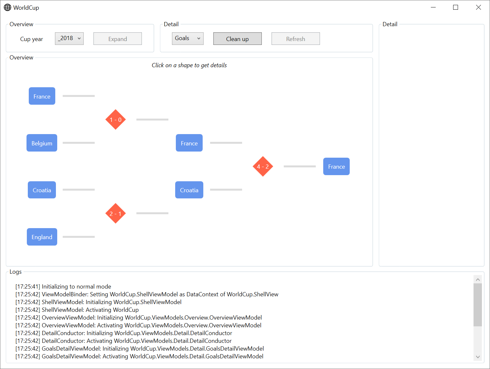
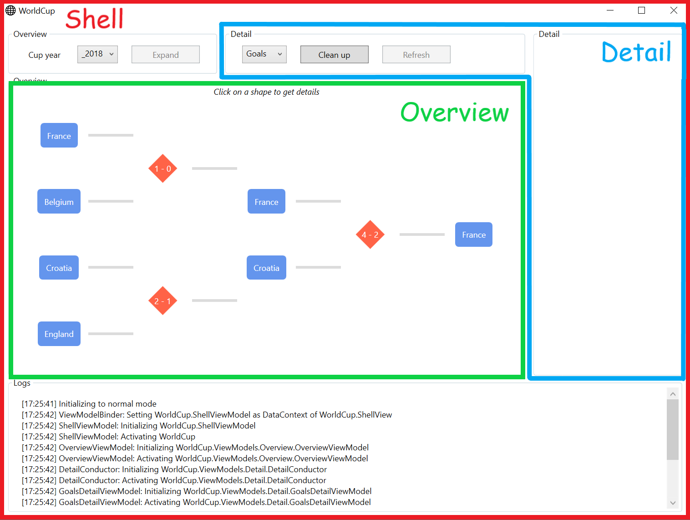
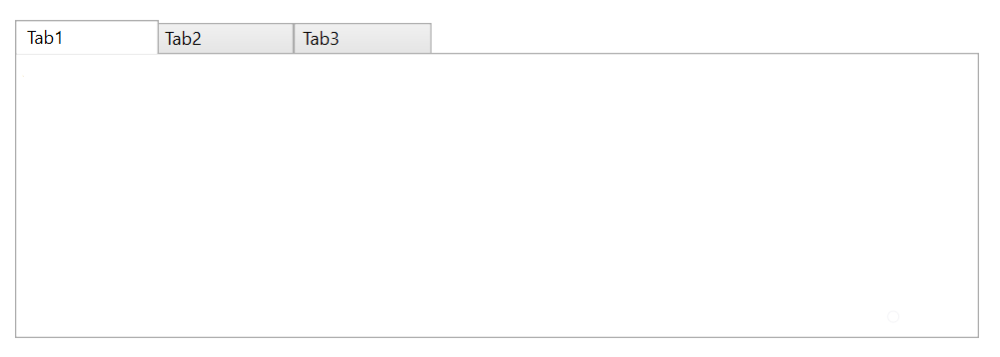
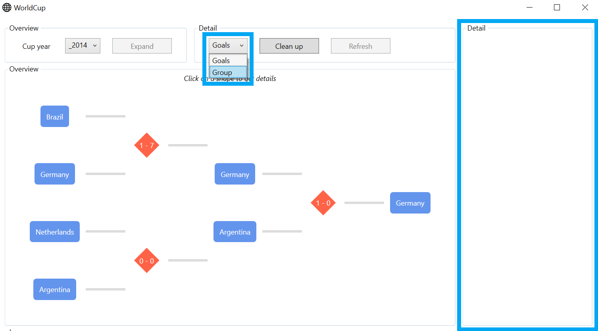
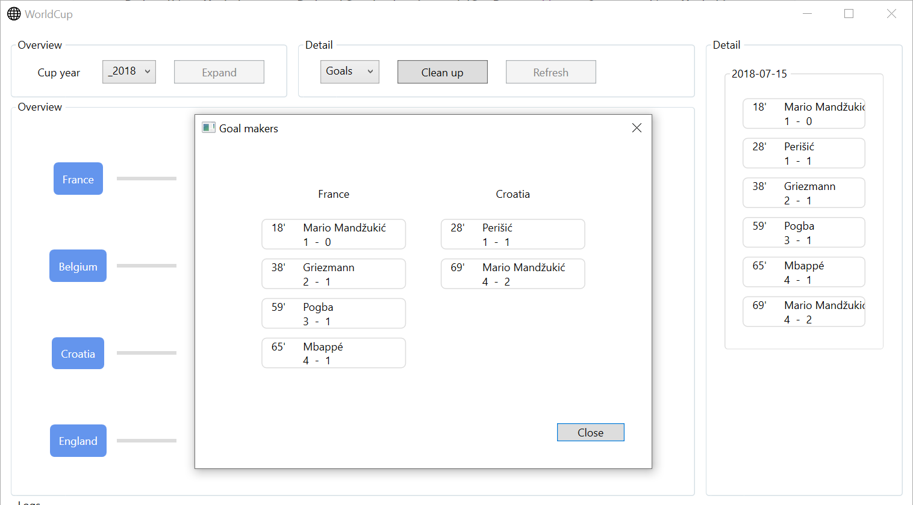

## WorldCup

#### Introduction

As we all know, with great power comes great responsibility. And with the power harnessed from the previous tutorial, you're well equipped to venture into the `WorldCup` sample project on your own.

If you look at the size of the project in the source repo, you'll agree that creating it from scratch would take us a while. Time better spent highlighting the parts that deserve our attention.


#### Overview

*What it is*

A showcase of the interactions between the component lifecycles in a composite view. All concrete `Conductor` implementations, that Inferno ships with, have been implemented in one way or another.

A showcase of how to relieve a conducting viewmodel, that's usually used as a mediator for all its children, from having to know their intricacies. 

*What it is not*

A showcase of how to model a domain. A database-driven, better yet json-driven, approach is taken. Resulting in an anemic domain model with public getters and setters. Given we're only going to put the Read in CRUD, this is partially warranted.


#### Composition

Our (Shell)View is made up of  a couple of components:

- An *Overview* where the user can select:
  - `TeamOverviewItem`s (blue rectangles) 
  - `MatchOverviewItem`s (red diamonds)

- A *Detail* pane on the right, where the selected overview item is explored.

- A *Logs* component at the bottom.

  




What does `ShellView.xaml` tell us?

- The layout is conceived by first docking the *Logs* to the bottom, next the *Detail pane* to the right, then the button groups to the top and finally the *Overview* to fill the remaining space.
- The *Logs* component is implemented then and there. That makes sense as the root `ShellViewModel` will have access to our logger and, of course, the XAML is rather limited.
- Last but not least, we're using two `CompositionControl`s to hook up our hosts.

```xaml
<inferno:RxWindow
    x:Class="WorldCup.ShellView"
    x:TypeArguments="local:ShellViewModel" 
    xmlns="http://schemas.microsoft.com/winfx/2006/xaml/presentation"
    xmlns:x="http://schemas.microsoft.com/winfx/2006/xaml"
    xmlns:mc="http://schemas.openxmlformats.org/markup-compatibility/2006"
    xmlns:d="http://schemas.microsoft.com/expression/blend/2008"
    xmlns:inferno="http://inferno.net"
    xmlns:local="clr-namespace:WorldCup"
    mc:Ignorable="d" WindowStartupLocation="CenterScreen"
    d:DesignHeight="300" d:DesignWidth="300"
    Height="768" Width="1024">
    <DockPanel LastChildFill="True" Margin="10">
        <GroupBox DockPanel.Dock="Bottom" Header="Logs" Height="200">
            <ScrollViewer x:Name="ScrollViewer" VerticalScrollBarVisibility="Auto">
                <ItemsControl x:Name="Logs" BorderBrush="Transparent" Margin="15" />
            </ScrollViewer>
        </GroupBox>
        <GroupBox DockPanel.Dock="Right" Header="Detail" Width="220" Margin="10 0 0 0">
            <inferno:CompositionControl x:Name="DetailHost" />
        </GroupBox>
        <Grid DockPanel.Dock="Top">
            <Grid.ColumnDefinitions>
                <ColumnDefinition Width="Auto" />
                <ColumnDefinition />
            </Grid.ColumnDefinitions>
            <GroupBox Grid.Column="0" Header="Overview" Padding="20 10">
                <!-- ... Left out for brevity -->
            </GroupBox>
            <GroupBox Grid.Column="1" Header="Detail" Padding="20 10">
                <!-- ... Left out for brevity -->
            </GroupBox>
        </Grid>
        <GroupBox Header="Overview">
            <inferno:CompositionControl x:Name="OverviewHost" />
        </GroupBox>
    </DockPanel>
</inferno:RxWindow>
```


#### Hosts

The `CompositionControl` is where view composition and component lifecycle meet. It will resolve the view for the viewmodel set in it its (aptly named) `ViewModel` property. Translated to our sample, `OverviewViewModel` and `DetailViewModel` are mapped to their corresponding views.

`ShellViewModel` is a `Conductor<IScreen>.Collection.AllActive`. It can have multiple children and all of them will be active at the same time. 





This doesn't mean it alleviates us from all bookkeeping, though. Back in `ShellViewModel`:

- The viewmodels are exposed, so they can be bound in the view's code behind.
- The `Items` collection, which is implemented on the `Conductor`, is the bookkeeping I was referring to. Given the existence of multiple types of conductors, this explicit bookkeeping provides most flexibility in the long run.

```c#
protected override Task OnInitializeAsync(CancellationToken cancellationToken)
{
    ... // Removed for brevity

    #region Hosts

    OverviewViewModel = new OverviewViewModel(_worldCupRepo.MatchesByYear, this);

    DetailViewModel = new DetailConductor(_worldCupRepo, this, OverviewViewModel);

    Items.AddRange(OverviewViewModel, DetailViewModel);

    #endregion Hosts

    return Task.CompletedTask;
}
```


Moving over to `ShellView.xaml.cs`:

- The viewmodels are bound for both hosts.
- The `DetailViewModel`, however, is a conductor too. In effect, its `ActiveItem` is the one that's bound.
- Both the `DetailOption`s `ComboBox` and the buttons from the *Detail* group box are fully configured by the `DetailViewModel` as depicted by the blue outlining in the screenshot above.

```c#
public ShellView()
{
    InitializeComponent();

    this.WhenLoaded(disposables =>
    {
        ... // Removed for brevity

        #region Hosts

        this.OneWayBind(ViewModel,
            viewModel => viewModel.OverviewViewModel,
            view => view.OverviewHost.ViewModel);

        this.OneWayBind(ViewModel,
            viewModel => viewModel.DetailViewModel.ActiveItem,
            view => view.DetailHost.ViewModel);
        
        this.OneWayBind(ViewModel,
            viewModel => viewModel.DetailViewModel.DetailOptions,
            view => view.Detail.ItemsSource);

        this.Bind(ViewModel,
            viewModel => viewModel.DetailViewModel.SelectedDetail,
            view => view.Detail.SelectedItem);

        this.BindCommand(ViewModel,
                viewModel => viewModel.DetailViewModel.CleanUpCommand,
                view => view.CleanUpDetailBtn)
            .DisposeWith(disposables);

        this.BindCommand(ViewModel,
                viewModel => viewModel.DetailViewModel.RefreshCommand,
                view => view.RefreshDetailBtn)
            .DisposeWith(disposables);

        #endregion Hosts
    });
}
```


#### Events

As a small intermezzo, let's scroll up in `ShellView.xaml.cs`:

```c#
public ShellView()
{
    InitializeComponent();

    this.WhenLoaded(disposables =>
    {
        ... // Removed for brevity

        #region Shell

        this.OneWayBind(ViewModel,
            viewModel => viewModel.Years,
            view => view.CupYear.ItemsSource);

        this.Bind(ViewModel,
            viewModel => viewModel.SelectedYear,
            view => view.CupYear.SelectedItem);

        this.OneWayBind(ViewModel,
            viewModel => viewModel.Logger.ItemsSource,
            view => view.Logs.ItemsSource);

        this.ScrollViewer.Events().ScrollChanged
            .Where(arg => Math.Abs(arg.ExtentHeightChange) > 0.001)
            .Do(_ => ScrollViewer.ScrollToEnd())
            .Subscribe()
            .DisposeWith(disposables);

        this.BindCommand(ViewModel,
                viewModel => viewModel.ExpandItemCommand,
                view => view.ExpandItemBtn)
            .DisposeWith(disposables);

        #endregion Shell

        ... // Removed for brevity
    });
}
```

Most should look familiar. I wanted to highlight `ScrollViewer.Events()` which will enable us to force the *Logs* to scroll to the end, when new items are added. You can find more on `Events` in ReactiveUI's [documentation](https://reactiveui.net/docs/handbook/events/). 

The main gotcha is that the right events will only be exposed when you add the using directive for the control you're applying `.Events()` to. Given `ScrollViewer` resides at `System.Windows.Controls`, a corresponding using directive is added at the top of the file.

The math copes with `double` rounding errors and makes sure we only scroll to the end when items have been added.


#### Conductor

The most enticing of `Conductor`s, IMHO, is `Conductor<T>.Collection.OneActive`. As luck would have it, `WorldCup` offers us a `DetailConductor` which derives from it and is also the type of `DetailViewModel`, bound to the host in the previous section.

A first question that might come to mind is: "`DetailConductor`, how does that map to a view with our naming conventions?". Turns out, it doesn't need to, as described in Caliburn-Micro's documentation on [Screens, Conductors and Composition](https://caliburnmicro.com/documentation/composition) `Conductor` can be viewed as a role, something abstract, and doesn't necessarily need to be visualized.

The textbook example of `Conductor<T>.Collection.OneActive` sets its `Items` collections as the `ItemsSource` of a `TabControl`. Just to spice things up a bit, how about we go from (yawn):



To: 




To be sure, instead of selecting an item by clicking on a tab header, we select one by choosing an option from the `ComboBox`. This event is eventually handled by the following method on `DetailConductor`:

- `DetailConductor` has only one item in its `Items` collection on start up.
- Another item, representing the `GroupDetailViewModel`, is added when the user changes selection.
- To find out if a requested item already exists in the `Items` collection a `type` based search is done. Admittedly, a bit unconventional, but that's not what matters here. 
- If the requested item exists, it is reinstated as `ActiveItem`.
- If not, a new instance is created and set as `ActiveItem`.

```c#
private Unit SwitchDetail(Detail detail)
{
    // Check if the requested detail is already in the Items collection

    var detailViewModelType =
        detail == Detail.Goals ? typeof(GoalsDetailViewModel) :
        detail == Detail.Group ? typeof(GroupDetailViewModel) :
        throw new NotImplementedException($"{nameof(Detail)} {detail}");

    var detailViewModel = Items.FirstOrDefault(vm => vm.GetType() == detailViewModelType);

    if (detailViewModel != null)
    {
        ActiveItem = detailViewModel;
    }
    else // Create new DetailViewModel
    {
        switch (detail)
        {
            case Detail.Goals:
                ActiveItem = new GoalsDetailViewModel(_worldCupRepo.MatchesByYear, _hasCupYear, _overview);
                break;

            case Detail.Group:
                ActiveItem = new GroupDetailViewModel(_worldCupRepo.GroupsByYear, _hasCupYear, _overview);
                break;

            default:
                throw new NotImplementedException($"{nameof(Detail)} {detail}");
        }
    }

    return Unit.Default;
}
```

The returned `Unit.Default` is to allow `SwitchDetail` to be called from a `WhenAnyValue` operator.

The final piece of the puzzle is right below. When the user clicks on the *Clean up* button:

- Here we bypass the normal flow and terminate the lifecycle of the `Items` ourselves. 
  Usually we would call `TryCloseAsync()` on an item to ask the item's `Conductor` to close it. Don't let this trip you up, if the item is not conducted `TryCloseAsync()` will do nothing.
- The `Items` collection is cleared
- The `ActiveItem` is set with a [null object](https://en.wikipedia.org/wiki/Null_object_pattern).

To ensure all references to the child items are removed.

```c#
private async Task CleanUp()
{
    foreach (var activatable in Items.OfType<IActivate>())
    {
        await activatable.DeactivateAsync(true, CancellationToken.None);
    }

    Items.Clear();

    ActiveItem = new EmptyDetailViewModel();
}
```


It's worth pointing out `EmptyDetailViewModel` is not a `Screen`, it's not even a `ReactiveObject`.

```c#
public class EmptyDetailViewModel : IChild
{
    public object Parent { get; set; }
}
```
This explains why `DetailConductor` is defined as `Conductor<IChild>.Collection.OneActive`. 

Because all framework behavior is abstracted over interfaces, everything still works even though `IChild` declares nothing related to component lifecycle.


#### Disposal

*Basics*

If we look at `GoalDetailViewModel` we see that the injected dependencies are stored.

```c#
public class GoalsDetailViewModel : Screen
{
    private readonly Dictionary<CupYear, IRepo<int, Match>> _matchesByYear;
    private readonly IHaveCupYear _hasCupYear;
    private readonly IHaveOverviewItem _overview;

    public GoalsDetailViewModel(Dictionary<CupYear, IRepo<int, Match>> matchesByYear, IHaveCupYear hasCupYear, IHaveOverviewItem overview)
    {
        _matchesByYear = matchesByYear;
        _hasCupYear = hasCupYear;
        _overview = overview;

        this.WhenActivated(disposables =>
        {
            this.WhenAnyValue(
                    x => x._hasCupYear.SelectedYear, 
                    x => x._overview.SelectedItem, 
                    UpdateDetail)
                .Subscribe()
                .DisposeWith(disposables);
        });
    }

    ... // Removed for brevity
}
```
If we take a step back to `ShellViewModel`:

```c#
protected override Task OnInitializeAsync(CancellationToken cancellationToken)
{
    ... // Removed for brevity

    #region Hosts

    OverviewViewModel = new OverviewViewModel(_worldCupRepo.MatchesByYear, this);

    DetailViewModel = new DetailConductor(_worldCupRepo, this, OverviewViewModel);

    Items.AddRange(OverviewViewModel, DetailViewModel);

    #endregion Hosts

    return Task.CompletedTask;
}
```

One of the injected dependencies is `ShellViewModel` itself. A question comes to mind: "If we store a reference to the `ShellViewModel` (albeit through an interface) on `GoalsDetailViewModel`, wont that keep the `GoalsDetailViewModel` alive?".

No, it is the other way around.

If `ShellViewModel` had a reference to the `GoalsDetailViewModel`, the `GoalsDetailViewModel` could never be garbage collected and we'd effectively have a memory leak. 

The same would happen if we wouldn't unsubscribe from an observable exposed by the `ShellViewModel`. The `ShellViewModel` needs a reference to the observer to play the role of observable, it needs to know where to send its messages. To be sure, if `GoalsDetailViewModel` subscribed to an observable on `ShellViewModel`, and never disposed of the subscription, their life times would be tied together.


*Nitty*

As nifty as ReactiveUI's scoped binding system is, it's heavily closure based. Closures tend to make it very easy to work yourself into a corner. That's because they can implicitly capture references, with no way to release them from the outside.

When dynamically switching a view's viewmodel, the first viewmodel instance is being kept alive (an [issue](https://github.com/reactiveui/ReactiveUI/issues/2384) has been raised). The problem is that the `EventHandler` from the `ILoadedForViewFetcher` closes over (captures) each viewmodel instance that's bound in the view's `WhenLoaded` scope (translated to ReactiveUI jargon that becomes the `IActivationForViewFetcher` and the view's `WhenActivated` scope).

As usual you can choose between memory or CPU cycles. If you want to get back the memory before the view is disposed, you could set a dummy viewmodel at load and use a timer (`Delay`) to set the real one. Unfortunately, this implies the bindings will already be in effect when the real viewmodel is (initialized and) activated.


#### Dialog

When there's an item selected on the *Overview*, the *Expand* button becomes enabled. It is used to spawn a dialog with yet another view of the item. To reuse code, a `GoalItemsControl` is brought to life, the dialog below renders two, while the *Detail* pane (still visible on the right) renders one. It could've been more, one for each day, had the selected item been a team, instead of a match.





To spawn a dialog you pass an `IDialogViewModel<TChoice>` to an `IDialogManager`, along with its settings.

```c#
var dialogResult = await _dialogManager.ShowDialog(dialogViewModel, DialogSettings);
```

Inferno provides a base implementation as a wrapper:

```c#
public class DialogViewModel<TChoice> : Conductor<IScreen>, IDialogViewModel<TChoice>
```

The last of the conductors, `Conductor<T>`, conducts just one item. Here it serves as a conductor for the `IScreen` that is passed as a ctor argument.

When the user clicks *Expand*:

- A `DialogViewModel` is created based on the type of the selected item
- `DialogViewModel`'s generic type is an `enum` that represents the text of different buttons. `ButtonChoice` is rather limited, for specialized dialogs you'll want to create your own.
- UX convention is applied, the left most button is used to confirm and the right most button to cancel. If you want fine grained control, you can construct the `ButtonContext<TChoice>`s yourself and pass those to the `DialogViewModel` overload.
- The `MatchDialogViewModel` and `TeamDialogViewModel` are the viewmodels specific to `WorldCup`.
- They map to `MatchDialogView` and `TeamDialogView` as you would expect.

```c#
private async Task<bool?> ExpandItem(IOverviewItem overviewItem)
{
    DialogViewModel<ButtonChoice> dialogViewModel;

    switch (overviewItem)
    {
        case MatchOverviewItem matchItem:
            dialogViewModel = new DialogViewModel<ButtonChoice>("Goal makers", new MatchDialogViewModel(matchItem), new[] { ButtonChoice.Close });
            break;

        case TeamOverviewItem teamItem:
            dialogViewModel = new DialogViewModel<ButtonChoice>("Team standing", new TeamDialogViewModel(teamItem, _worldCupRepo.StandingsByYear[SelectedYear]), new[] { ButtonChoice.Close });
            break;

        default:
            throw new NotImplementedException($"{nameof(IOverviewItem)} {overviewItem.GetType()}");
    }

    var dialogResult = await _dialogManager.ShowDialog(dialogViewModel, DialogSettings);

    return dialogResult;
}
```


On `ShellViewModel` the sample above, combined with the one below, drive the dialogs.

```C#
#region Dialog

this.WhenInitialized(disposables =>
{
    var selectedOverviewItemObservable =
        this.WhenAnyValue(x => x.OverviewViewModel.SelectedItem)
            .Log("Overview", LoggingEventType.Information, item =>
                item is MatchOverviewItem matchItem ? $"Selected {matchItem.Match.Team1.Name} - {matchItem.Match.Team2.Name}" :
                item is TeamOverviewItem teamItem ? $"Selected {teamItem.Team.Name}" : "No item selected");

    var canExpandItem =
        selectedOverviewItemObservable
            .Select(item => item != null);

    var executeExpand =
        selectedOverviewItemObservable
            .SelectMany(ExpandItem)
            .Take(1);

    ExpandItemCommand = ReactiveCommand.CreateFromObservable(() => executeExpand, canExpandItem).DisposeWith(disposables);
});

#endregion Dialog
```


If you look around a bit, you'll notice there's virtually no other behavior defined on the `ShellViewModel`. The activation is forwarded implicitly, and al component logic is housed in the components themselves.


To do:

- Which are the type of scopes that are used to set up the reactive pipelines?
- Why would you pass the dependencies as property based interfaces, instead of observables?


#### Next

?


